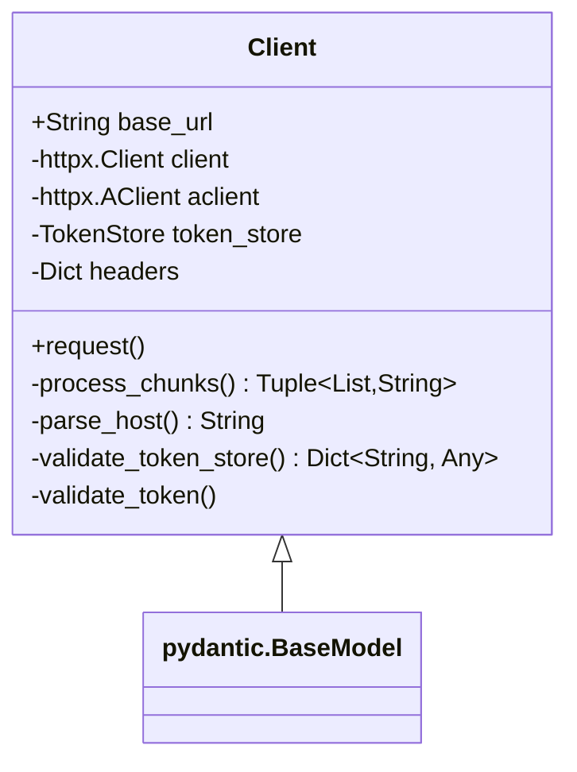
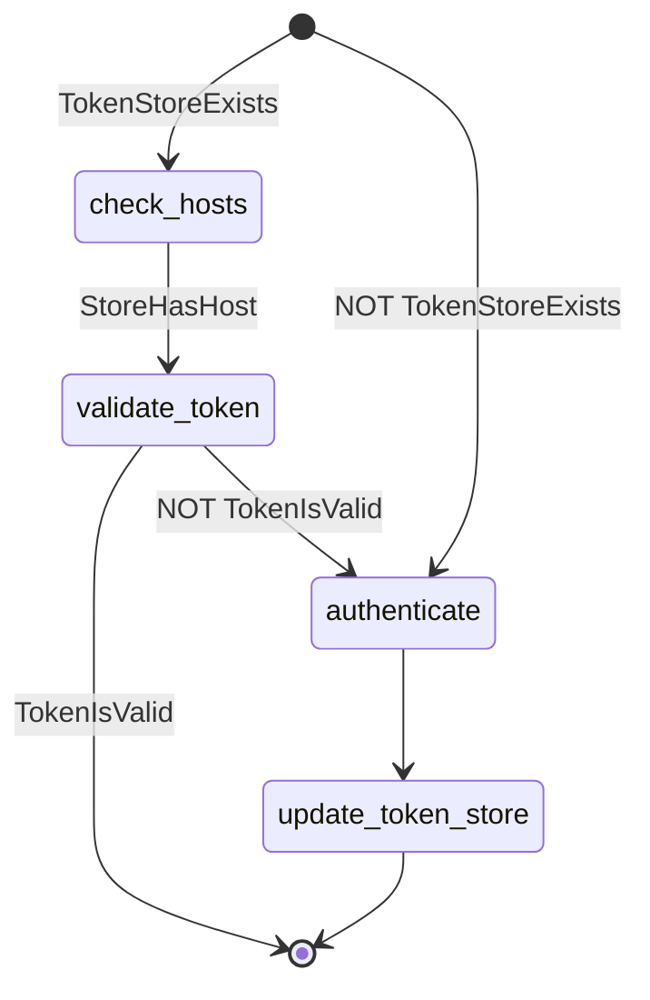
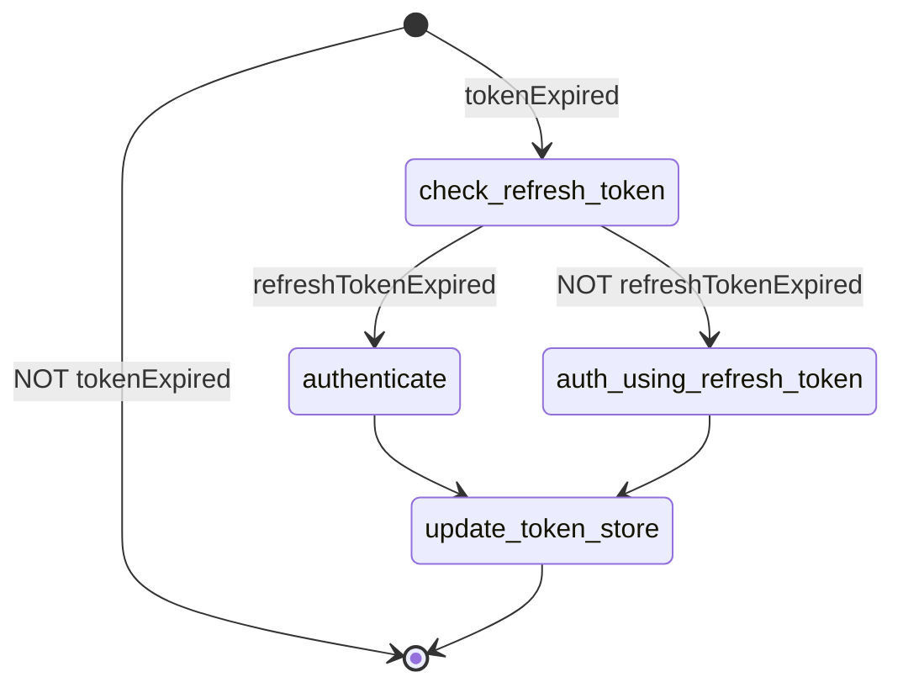
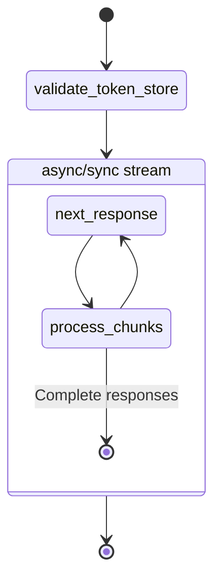

# Client Class



A class that can be invoked to start an http session to a given instance of FrevaGPT. 

## Params
**base_url** (*str*): The url to the instance hosting FrevaGPT. It is assumed that it exposes the following paths: 
 * `/api/freva-nextgen` (and associated endpoints for authentication purposes) 
 * `/api/chatbot` (for querying the chatbot).

## Attributes:
**base_url** (*str*): see above.<br>
**_token_store** (*py_oidc_auth_client.TokenStore*): A store containing the (json-encoded) token (plus all associated info) for authentication with the api. By default will be stored under `~/.cache/py-oidc-auth/token-store.json`on Linux systems.<br>
**_header** (*dict*): A dictionary containing HTTP headers for any request made by the client. Contains the bearer token for authentication.
**_client** (*httpx.Client*): A synchronous http client for making requests.<br>
**_aclient** (*httpx.AsyncClient*): An asynchronous http client for making requests.

## Methods:
### `validate_token_store`
```python
@model_validator(mode="before")
@classmethod 
```

Checks if the token store exists, if it contains the host (as set in the `base_url`) and if the token is valid. Prompts the user to authenticate in any other case.

### `validate_token`
```python
@model_validator(mode="after")
```

For a given token, check if the token is expired. If the token is expired, check the refresh token and use it to generate a new token. If the refresh token is also expired, prompt the user to authenticate themselves.
### `process_chunks`
Processes a chunk of string data, which represent JSON-like objects split across chunks.

Args: <br>
chunk (str): A string that may contain full or partial JSON-like objects.
partial_response (str): A string that stores an incomplete JSON-like object from the previous chunk.

Returns: <br>
Tuple[List[str], str]: A list of complete JSON-like objects and the partial string (if any).

### `parse_host`
Parses a given string, assumed to containing a host name or ip-address. In the case of a host name, tries to resolve host first. 
Returns a string of the kind `{scheme}://{host}:{port}`.

### `request`

Makes a GET request to a given URL. If `stream=True`, will return an Iterator, otherwise will return the entire response at once.
Includes error handling, in case connection cannot be established.