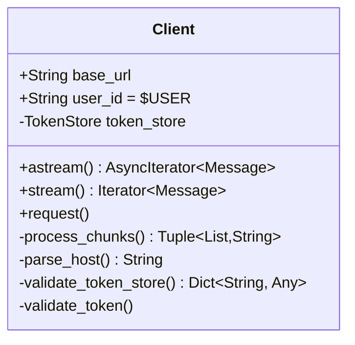

```mermaid
    classDiagram
    class Client {
        +String base_url
        +String user_id = $USER
        -TokenStore token_store
        +astream() AsyncIterator~Message~
        +stream() Iterator~Message~
        +request() 
        -process_chunks() Tuple~List,String~
        -parse_host() String
        -validate_token_store() Dict~String, Any~
        -validate_token() 
    }
```